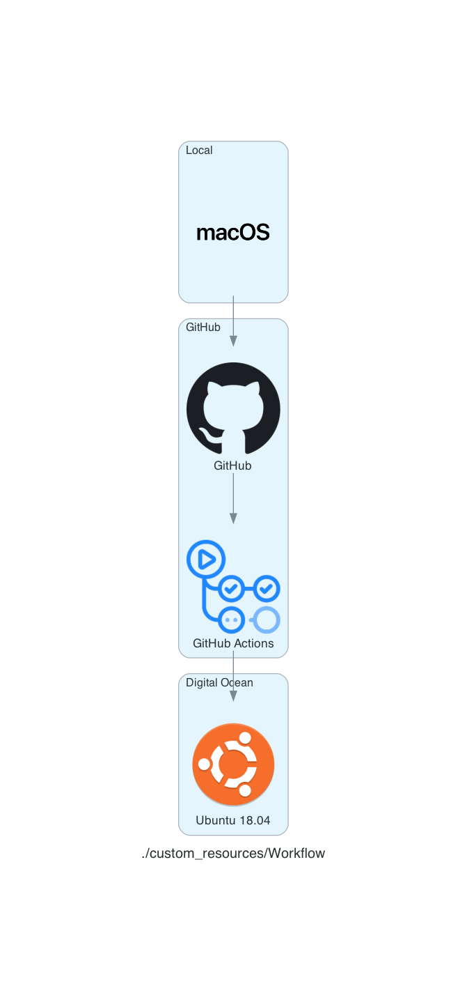
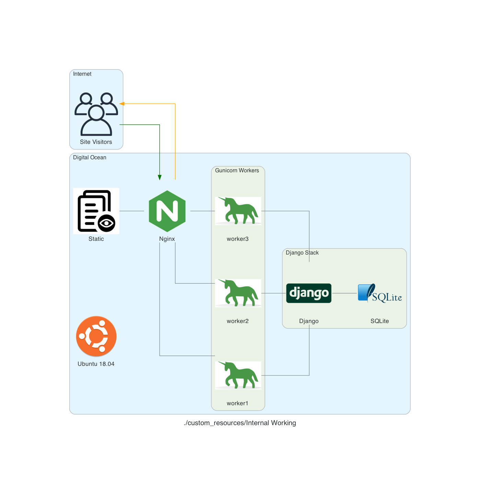

# Tatis

[](https://justforfunnoreally.dev)

This is a project I created to troll my friend Barry. He's a huge [Padres](https://www.mlb.com/padres) fan, and I'm a huge [Dodgers](https://www.mlb.com/dodgers) fan.

The site can be found [here](https://doestatisjrhaveanerrortoday.com)

It answers one simple question:

> Does Fernando Tatis Jr have an error today?

It will return either `Yes` or `No`

And it has a silly image of a throw that Tatis is making.

If you're a Padre fan you look at it and believe he's making an unbelievable throw to get someone out

If you're not, you know that Tatis is forking up the throw :)

## How this works

I use a MacBook Pro to work on the code. I then deploy it to a Digital Ocean server using GitHub Actions. But they say, a picture is worth a thousan words, so here's a chart of the workflow:



But, you might ask, how is it that when I go to the site, I see anything? I thought I understood it, and when I tried to actually draw it out, turns out I didn't!

After a bit of Googling, I found [this](https://serverfault.com/a/331263) and it helped me to create this:



These diagrams are generated using the amazing llibrary [Diagrams](https://github.com/mingrammer/diagrams). The code used to generate them is [here](generate_diagram.py)

## Development

Development is done locally by creating a feature branch

```
git switch -c feature_branch_name
```

Once local development is ready to be moved to Prod you will push the feature branch to github

```commandline
git push origin feature_branch_name
```

This will push to GitHub and run the GitHub Action `django.yml` which will run tests.

## Deployment

In order to deploy to `prod` you will need to perform a Pull Request to `main` and Merge on GitHub
